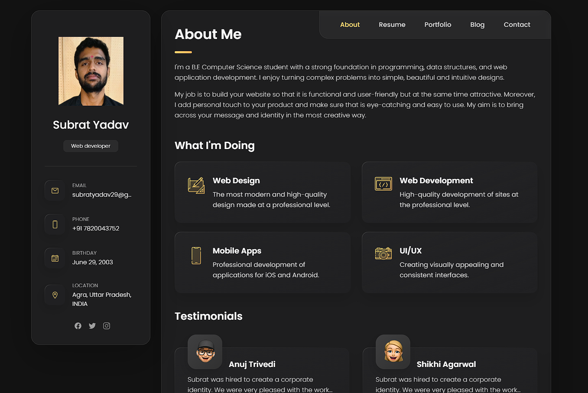

# Personal portfolio

A personal portfolio website, responsive for all devices, built using HTML, CSS, and JavaScript.

## Demo


<!--  -->

## Prerequisites

Before you begin, ensure you have met the following requirements:

* [Git](https://git-scm.com/downloads "Download Git") must be installed on your operating system.

## Clone the repository

To clone repo, follow these steps:

Linux and macOS:

```bash
sudo git clone https://github.com/Subrat29/Personal-Portfolio.git
```

Windows:

```bash
git clone https://github.com/Subrat29/Personal-Portfolio.git
```

## Contact

If you want to contact me you can reach me at [Linkedin](https://www.linkedin.com/in/subratyadav/)

## Inspired by
[codewithsadee](https://github.com/codewithsadee/vcard-personal-portfolio)